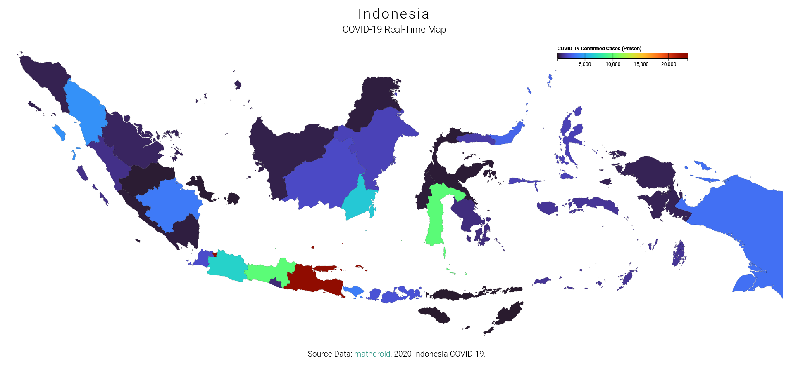

# User Interface

# How to see the data?
just hover your mouse cursor to the certain province area that you wanted to see the covid-19 data, it's including confirmed, recovered, and death data.

# Link to the Site
https://variousnabil.github.io/Indonesia-COVID19-Realtime-Map/

# Source API 
- realtime covid19 indonesia API from https://github.com/mathdroid/indonesia-covid-19-api
- indonesia TopoJSON file from https://github.com/ghapsara/indonesia-atlas
